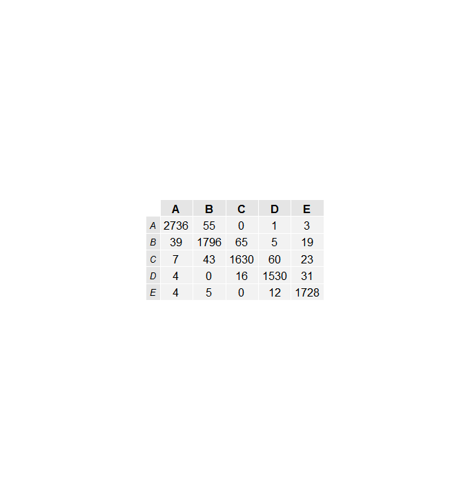
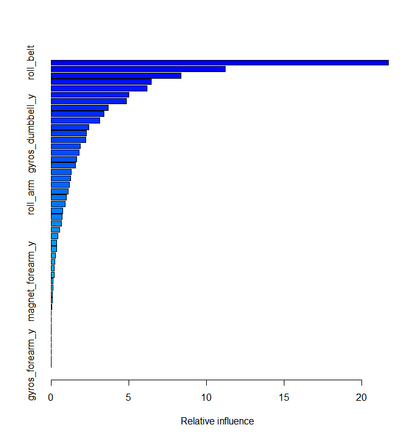

###Executive Summary
The goal of this project was to create a machine learning model that predicts the activity class of measurements from personal fitness devices.  A generalized boosting model was chosen to operate on a subset of the training data set.  That model was them cross-validated on the remaining data and demonstrated a 96% accuracy in prediction.  Similar results were obtained when the training and testing subsets were flipped. The final results of testing this model was against the 20 test cases provided for the assignment, for which the model predicted all correctly.  
```{r,echo=FALSE,warning=FALSE,message=FALSE,results='hide',include=FALSE}
library(lattice)
library(ggplot2)
library(splines)
library(survival)
library(caret)
library(gbm)
library(gridExtra)
library(parallel)
library(plyr)
```
###Process
The data set for this project was obtained here:  and their gracious allowance of the use of their data is greatly appreciated.  The CSV file provided contains 19622 obervations, each of which contains 160 data fields. These fields are a combination of physical measurements, statistical reductions and metadata for each measurement.  The only metadata that is relevant to this modeling is the excercise class, the variable called classe, which is the thing to be precicted based on the physical measurements.  The statistical fields and other metadata are not useful and so are removed.  This leaves 48 variables and the predictor class. 
```{r,warning=FALSE,message=FALSE,results='hide'}
pml.training <- read.csv("pml-training.csv", header=TRUE)
```
```{r,echo=FALSE,warning=FALSE,message=FALSE,results='hide'} 
#suppress the output of this - see table 1
cnames=c("roll_belt","pitch_belt","yaw_belt","gyros_belt_x","gyros_belt_y","gyros_belt_z","accel_belt_x","accel_belt_y","accel_belt_z","magnet_belt_x","magnet_belt_y","magnet_belt_z","roll_arm","pitch_arm","yaw_arm","gyros_arm_x","gyros_arm_y","gyros_arm_z","accel_arm_x","accel_arm_y","accel_arm_z","magnet_arm_x","magnet_arm_y","magnet_arm_z","roll_dumbbell","pitch_dumbbell","yaw_dumbbell","gyros_dumbbell_x","gyros_dumbbell_y","gyros_dumbbell_z","accel_dumbbell_x","accel_dumbbell_y","accel_dumbbell_z","magnet_dumbbell_x","magnet_dumbbell_y","magnet_dumbbell_z","roll_forearm","pitch_forearm","yaw_forearm","gyros_forearm_x","gyros_forearm_y","gyros_forearm_z","accel_forearm_x","accel_forearm_y","accel_forearm_z","magnet_forearm_x","magnet_forearm_y","magnet_forearm_z","classe")
```
```{r,echo=TRUE,warning=FALSE,message=FALSE,results='hide'}
pml.training=pml.training[,cnames]

```
### Some Things to Note
Because we have limits on report length, the name list of fields is included as a table in Figure 1 at the end of this report, but is generated and contained in 'cnames'.  Because running machine learning models on large data sets is time consuming, for this report I use a smaller sample size than I did to predict the 20 evaluation variables.  I will note this in comments as I go. 

### Subset Data
To allow for model cross validation, the original data set imported as 'pml.training' is subset using createDataPartition().  For the full test, I used a p-value of 0.5, splitting the set into two, each with 9800 observations.  In this document, becuase Knitr has to run all of this when it compiles, I will be using a p-value of 0.05.  If you wish to rerun for validation, simply change this to 0.5.  
```{r,echo=TRUE,results='hide'}
#uncomment below to make big data set
#train1<-createDataPartition(y=pml.training$classe,p=0.5,list=FALSE)
#and comment out this next line
train1<-createDataPartition(y=pml.training$classe,p=0.05,list=FALSE)
t1=as.data.frame(pml.training[train1,])
t2=as.data.frame(pml.training[-train1,])
```
We end up with two subsets of the pml.traning data, t1 & t2. We'll train on t1 first then cross-validate on t2.

### Create test model 1
To get a generalized boosting model, we use train with the 'gbm' method.  On the larger data sets, the model run takes 20-30 minutes on a laptop.  For smaller data sets, only a few minutes.  Run on the larger subsets, there only 40 of 48 variables are found to have any significant weight in the model.  Further work could trim some of those zero and low weight variables, but they aren't hurting anything here.
```{r,echo=TRUE,results='hide',cache=TRUE}
boost1=train(classe~.,data=t1,method='gbm')
```
### Cross-validate
For cross-validation, we use the predict function on the other data set and compare it to the known 'classe'.  With the smaller subset, the accuracy is ~89%, compared to using half the provided data, which gives an accuracy of ~96%.  
```{r,echo=TRUE,results='hide'}
pt2=predict(boost1,newdata=t2)
conf2from1=confusionMatrix(pt2,t2$classe)
```
### Reverse test and train
One further cross-validation is done, reversing the two sets, make a new model and predict.  This doesn't work for the smaller set, because the testing set is large, so I just sue a second small sample.  For the larger subsets this a similar 96% accuracy is obtained.  For the second small subsample, the accuracy is also ~89%. This model technique is accurate and stable on this data set. 

```{r,echo=TRUE,results='hide',cache=TRUE}
# for the large data set case, comment out the following three lines
train2<-createDataPartition(y=pml.training$classe,p=0.05,list=FALSE)
t1=as.data.frame(pml.training[-train2,])
t2=as.data.frame(pml.training[train2,])
# to here

boost2=train(classe~.,data=t2,method='gbm')
pt1=predict(boost1,newdata=t1)
conf1from2=confusionMatrix(pt1,t1$classe)
```

Figure 2 & 3 shows the confusion matrices for these vaildation tests.

### Run full model
Finally, having shown that the generalized boost model performs well on this dataset, I rerun the model on the entire set.  This line is commented out here so that Knitr doesn't take 30 minutes to generate it.  Figure 4 shows a plot of the relative influence of each of the measurement variables in the full model.  For the full model, the out of sample error is expected to be less than that for the half-size training data, thus the expected error is <4% for out of sample data points. This is consistent with and supported by the 100% accuracy on the project evaluation data. 

```{r,echo=TRUE,results='hide',cache=TRUE}
#uncomment to make full model
#boost_full=train(classe~.,data=pml.training,method='gbm')
```

### Results
The generated full model correctly predicted 20 out of 20 of the supplied evaluation tests. Generalized boosting models worked very well for this dataset.

##Figures
Figure 1 - Data Field Table - These are the data fields included in the data set.
```{r}
cnames
```

Figure 2 - Confusion Matrix for the p=0.05 small subset training sets, showing approximately 89% accuracy.
```{r}
conf1from2$table
conf2from1$table
```
Figure 3 - Confusion Matrix for the p=0.5 large subset training sets, showing approximately 96% accuracy.




Figure 4 - Influence Plot for Full Model - This bar plot shows the relative influence of each of the observation variables included in the final model.


